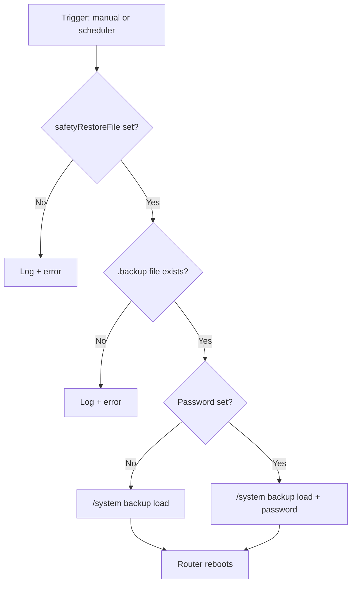

# MikroTik Scheduled Safety Restore

**English** · [Magyar](#magyar)

RouterOS 7.x **safety restore** solution: a manual or scheduled script loads a specified `.backup` file, then the router **reboots automatically**.

Useful for remote configuration experiments when you need a reliable rollback to a known-good state.

---

## Contents

| Folder | Files |
|--------|-------|
| [`english/`](english/) | English comments and log messages |
| [`hungarian/`](hungarian/) | Hungarian comments and log messages |

Each folder contains:

| File | Description |
|------|-------------|
| `safety-restore-script.rsc` | The `safety-restore` system script |
| `safety-restore-scheduler.rsc` | The `safety-restore-schedule` scheduler (**disabled by default**) |

Pick **one language folder** — both install the same script and scheduler names on the router.

---

## Important: load onto the router first, then edit there

**Do not edit the `.rsc` files for every change.** The recommended workflow:

1. Upload both files to the router.
2. Import the script and the scheduler.
3. **Edit settings on the router** (Winbox or CLI) — backup filename, password, schedule.

This keeps the live configuration on the device; you avoid re-exporting and re-importing for every small tweak.

---

## Installation

### 1. Upload the backup file

The `.backup` file to restore must already be on the router under **Files** (FTP, Winbox → Files, etc.).

### 2. Upload the `.rsc` files

Choose your language folder and upload both files to the router (e.g. root directory):

**English:**
- `english/safety-restore-script.rsc`
- `english/safety-restore-scheduler.rsc`

**Hungarian:**
- `hungarian/safety-restore-script.rsc`
- `hungarian/safety-restore-scheduler.rsc`

### 3. Import on the router

**Script first**, then the scheduler:

```routeros
/import file=safety-restore-script.rsc
/import file=safety-restore-scheduler.rsc
```

> After import, the script and scheduler live in the router configuration. From here on, **edit them on the router**.

---

## Configuration on the router

### Backup file and password

Winbox: **System → Scripts → safety-restore → Source**

Or CLI:

```routeros
/system script edit safety-restore source
```

Set at the top of the script:

```routeros
:global safetyRestoreFile "your_backup_filename.backup"
:global safetyRestorePassword ""
```

| Variable | Meaning |
|----------|---------|
| `safetyRestoreFile` | Backup filename on the router (`.backup` suffix optional) |
| `safetyRestorePassword` | Encrypted backup password; empty = unencrypted backup |

### Scheduling (optional)

The scheduler is **disabled=yes** by default — it will not run on its own.

Winbox: **System → Scheduler → safety-restore-schedule**

| Field | Suggested value |
|-------|-----------------|
| `on-event` | `safety-restore` (already set) |
| `start-time` | e.g. `22:30:00` |
| `start-date` | desired date |
| `disabled` | `no` — only when you actually want to schedule it |

CLI example — enable for 22:30:

```routeros
/system scheduler set safety-restore-schedule start-time=22:30:00 disabled=no
```

---

## Usage

### Run immediately (test)

```routeros
/system script run safety-restore
```

The router loads the backup and **reboots**. Only run this when you are ready to restore.

### Scheduled run

If the scheduler is enabled, it runs automatically at the configured time.

### Cancel

Disable the scheduler (script and settings remain):

```routeros
/system scheduler disable safety-restore-schedule
```

---

## How it works



Script steps:

1. Verify the filename is configured
2. Handle optional password
3. Append `.backup` extension if missing
4. Check the file exists on the router
5. Load backup and reboot

---

## Log messages

Look for the `safety-restore:` prefix in **Log**:

- `error` — missing filename or backup not found
- `warning` — before a successful restore (filename, encryption status)

---

## Removal

```routeros
/system scheduler remove [find name=safety-restore-schedule]
/system script remove [find name=safety-restore]
```

The `.backup` file and uploaded `.rsc` files can be deleted separately from **Files**.

---

## Requirements

- **RouterOS 7.x** (exported on 7.23.1)
- Script policy includes required permissions (`reboot`, `write`, etc.)
- Backup file must be on router flash/storage

---

## Security notes

- Restore is **immediate and irreversible** — current configuration is overwritten.
- Test with a manual run before enabling the scheduler.
- For encrypted backups, the password is stored on the router — use only in trusted environments.
- With remote access, consider that loading the wrong backup may cut off connectivity.

---

## License

Copyright © 2026 Sprotni

This project is licensed under the [GNU General Public License v3.0](LICENSE).

---
---

# Magyar

[English](#mikrotik-scheduled-safety-restore)

RouterOS 7.x-hez készült **biztonsági visszaállító** megoldás: egy ütemezett vagy kézi script betölti a megadott `.backup` fájlt, majd a router **automatikusan újraindul**.

Hasznos pl. távoli konfigurációs kísérleteknél, amikor biztos visszaút kell egy ismert, működő állapotra.

---

## Tartalom

| Mappa | Tartalom |
|-------|----------|
| [`english/`](english/) | Angol kommentek és log üzenetek |
| [`hungarian/`](hungarian/) | Magyar kommentek és log üzenetek |

Mindkét mappában:

| Fájl | Mit tartalmaz |
|------|----------------|
| `safety-restore-script.rsc` | A `safety-restore` system script |
| `safety-restore-scheduler.rsc` | A `safety-restore-schedule` scheduler (alapból **kikapcsolva**) |

**Egy nyelvi mappát** válassz — mindkettő ugyanazt a scriptet és schedulert telepíti a routerre.

---

## Fontos: először a routerre, aztán ott szerkesztés

**Ne a `.rsc` fájlokat szerkeszd minden alkalommal.** A helyes munkafolyamat:

1. Töltsd fel mindkét fájlt a routerre.
2. Importáld be a scriptet és az időzítőt.
3. A **beállításokat a routeren** módosítsd (Winbox vagy CLI) — backup fájlnév, jelszó, időpont.

Így a konfiguráció a routeren marad, és nem kell újra exportálni/importálni minden apró változtatásnál.

---

## Telepítés

### 1. Backup fájl feltöltése

A visszaállítandó `.backup` fájlnak már a router **Files** táblájában kell lennie (FTP, Winbox → Files, stb.).

### 2. `.rsc` fájlok feltöltése

Válaszd ki a nyelvi mappát, és töltsd fel mindkét fájlt a routerre (pl. gyökérkönyvtár):

**Magyar:**
- `hungarian/safety-restore-script.rsc`
- `hungarian/safety-restore-scheduler.rsc`

**Angol:**
- `english/safety-restore-script.rsc`
- `english/safety-restore-scheduler.rsc`

### 3. Import a routeren

**Először a script**, utána az időzítő:

```routeros
/import file=safety-restore-script.rsc
/import file=safety-restore-scheduler.rsc
```

> Az import után a script és a scheduler már a router konfigurációjában van. Innentől **ott** szerkeszd őket.

---

## Beállítás a routeren

### Backup fájl és jelszó

Winbox: **System → Scripts → safety-restore → Source**

Vagy CLI:

```routeros
/system script edit safety-restore source
```

A szkript elején állítsd be:

```routeros
:global safetyRestoreFile "ez_a_backup_fajlnev.backup"
:global safetyRestorePassword ""
```

| Változó | Jelentés |
|---------|----------|
| `safetyRestoreFile` | A routeren lévő backup fájl neve (`.backup` végződés opcionális) |
| `safetyRestorePassword` | Titkosított backup jelszava; üres = titkosítás nélküli mentés |

### Ütemezés (opcionális)

Alapból az időzítő **disabled=yes** — nem fut magától.

Winbox: **System → Scheduler → safety-restore-schedule**

| Mező | Ajánlott érték |
|------|----------------|
| `on-event` | `safety-restore` (már be van állítva) |
| `start-time` | pl. `22:30:00` |
| `start-date` | a kívánt dátum |
| `disabled` | `no` — csak ha tényleg ütemezni akarod |

CLI példa — aktiválás este 22:30-kor:

```routeros
/system scheduler set safety-restore-schedule start-time=22:30:00 disabled=no
```

---

## Használat

### Azonnali futtatás (teszt)

```routeros
/system script run safety-restore
```

A router betölti a backupot és **újraindul**. Csak akkor futtasd, ha készen állsz a visszaállításra.

### Ütemezett futtatás

Ha az időzítő engedélyezve van, a megadott időpontban automatikusan lefut.

### Lemondás

Az időzítő kikapcsolása (a script és a beállítások megmarad):

```routeros
/system scheduler disable safety-restore-schedule
```

---

## Működés röviden

A fenti angol szekcióban látható diagram ugyanezt a folyamatot mutatja.

A script lépései:

1. Ellenőrzi, hogy meg van-e adva a fájlnév
2. Opcionális jelszó kezelése
3. `.backup` kiterjesztés pótlása, ha hiányzik
4. Fájl létezés ellenőrzése a routeren
5. Betöltés és automatikus reboot

---

## Log üzenetek

A **Log** ablakban keresd a `safety-restore:` prefixet:

- `error` — hiányzó fájlnév vagy nem létező backup
- `warning` — sikeres indítás előtt (fájlnév, titkosítás státusza)

---

## Eltávolítás

```routeros
/system scheduler remove [find name=safety-restore-schedule]
/system script remove [find name=safety-restore]
```

A `.backup` fájl és a feltöltött `.rsc` fájlok külön törölhetők a **Files** menüből.

---

## Követelmények

- **RouterOS 7.x** (export: 7.23.1)
- A script policy-ja tartalmazza a szükséges jogosultságokat (`reboot`, `write`, stb.)
- A backup fájlnak a router flash/storage-én kell lennie

---

## Biztonsági megjegyzések

- A visszaállítás **visszafordíthatatlan** az adott pillanatban — minden jelenlegi konfiguráció felülíródik.
- Teszteld előbb kézi futtatással, mielőtt engedélyezed az időzítőt.
- Titkosított backupnál a jelszót a routeren tárolod — csak megbízható környezetben használd.
- Távoli elérésnél gondold végig: ha rossz backupot tölt be, elveszhet a kapcsolat.

---

## Licenc

Copyright © 2026 Sprotni

A projekt a [GNU General Public License v3.0](LICENSE) licenc alatt áll.
